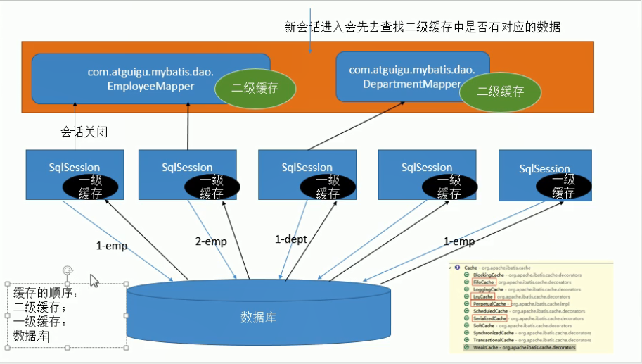

# 缓存简介

使用缓存可以极大地提升查询效率

mybatis默认提供了二级缓存

* 一级缓存默认开启，SqlSession级别
* 二级缓存手动开启，基于namespace级别的缓存

# 一级缓存体验

* 一级缓存（本地缓存）：

  * 与数据库同义词会话期间查询到的数据会放在本地缓存中。

    以后如果需要获取相同的数据，直接从缓存中拿，没必要再查询数据库

* 二级缓存(全局缓存)

# 一级缓存失效的四种情况

1. 不同的sqlSession（**新的**openSession**会话**）
2. sqlSession相同，查询**语句不同**
3. sqlSession相同，两次查询之间执行了**增删改**操作（无论这次操作对当前数据是否有影响）
4. sqlSession相同，**手动清除**了一级缓存（缓存清空openSession.clearCache()）

**mybatis的缓存本质上是新建了一个map来保存数据**

# 二级缓存介绍

二级缓存（全局缓存）：基于namespace（即xml文件的命名空间）级别的缓存，一个namespace对应一个二级缓存

* 工作机制：

1. 当一个会话查询完一条数据后，自动放入一级缓存
2. 会话关闭，一级缓存中数据放入二级缓存；新会话可以参照二级缓存中内容

* 使用方式：

1. 在全局配置文件`mybatis-config.xml`中使用`<setting name="cacheEnabled" value="true"/>`开启二级缓存。设为false只会关闭二级缓存，不会关闭一级
2. 去每个mapper.xml中配置使用二级缓存
3. 在映射文件中使用`<cache />`标签来启用二级缓存
4. 由于mybatis缓存使用了序列化，所以POJO需要实现序列化接口

* cache标签属性

1. eviction=""：缓存回收策略
                      ●LRU -最近最少使用的:移除最长时间不被使用的对象。
                      ●FIFO -先进先出:按对象进入缓存的顺序来移除它们。
                      ●SOFT -软引用:移除基于垃圾回收器状态和软引用规则的对象。
                      ●WEAK -弱引用:更积极地移除基于垃圾收集器状态和弱引用规则的对象。
                      ●默认的是LRU。

2. flushInterval=""：缓存刷新间隔
                           缓存多久清空一次，默认不清空

3. readOnly=""：是否只读

   ​						true：只读：mybatis认为所有从缓存中获取数据的操作都是只读操作，不会修改数据。

   ​											mybatis为了加快获取速度，直接就会将数据在缓存中的引用交给用户。不安全，速度快

   ​						flase：非只读：mybatis觉得获取的数据可能会被修改。

   ​											mybatis利用序列化&反序列化克隆一份新的数据给你。安全，速度慢

4. size=""：多少个元素

5. type=""：指定自定义缓存全类名；

   ​				mybatis提供了Cache接口，实现这个接口后放到type中即可

**注意：查出的数据都会被默认先放在一级缓存，只有会话提交或者关闭以后，一级缓存的数据才会被转移到**

​		**二级缓存中**

每个select标签中都有：

* useCache

  -true**默认**：使用缓存

  -false：关闭二级缓存

每个**增删改**标签都有

* flushCache

  -true**（默认）**：执行完后清除缓存（一、二级都清）

  -false**（查询语句默认）**：执行完不清除

openSession.clearCache();只会清除当前sqlSession的一级缓存

**全局配置中另外的一些缓存相关配置**

localCacheScope：本地缓存作用域。（一级）

​	-SESSION：当前会话的所有数据保存在会话缓存中

​	-STATEMENT：no data，不会有数据在当前会话中进行数据共享（可以禁用一级缓存）

**缓存原理图示**

# 整合第三方缓存框架

待补充。。。